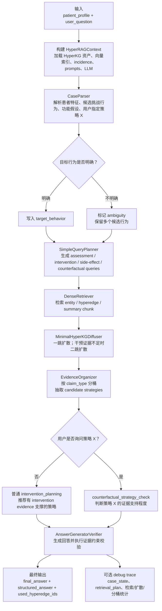

# HyperRAG Agent 流程介绍

本文档用偏文字化的方式说明 `workflows/HyperRAG` 中这个 Autism HyperKG RAG agent 的工作流程。它的主入口是 `autism_hyperkg_rag(patient_profile, user_question)`，目标是在给定患者画像和用户问题后，从已经构建好的 HyperKG 证据资产中检索、扩散、组织证据，并生成带有证据约束的干预建议或反事实判断。

## 1. 整体定位

这个 agent 不是一个单纯的向量检索问答系统，而是一个围绕“个案理解 - 检索计划 - HyperKG 证据扩散 - 证据分桶 - 受约束回答生成”的流程化 RAG。它服务的典型场景是：用户描述一个自闭症相关个案，例如年龄、语言能力、环境、照护背景、挑战行为及触发条件，然后询问应该采用什么干预策略，或者询问某个具体策略是否合适。

系统内部会尽量把“个案信息”和“证据信息”分开处理。个案信息来自用户输入，证据信息来自 HyperKGBuilder 已经生成的 hyperedge、entity、summary chunk 和对应的向量索引。最终回答必须基于检索到的证据，不能随意推荐没有证据支撑的策略。

## 2. 流程图



## 3. 输入与上下文准备

agent 的输入由两部分组成：

- `patient_profile`：患者或个案背景，例如诊断、年龄阶段、功能能力、所处环境、照护者等。
- `user_question`：用户的实际问题，例如“应该尝试什么干预？”或“sensory integration therapy 是否合适？”

在正式执行前，系统会构建 `HyperRAGContext`。这个上下文加载了几类关键资源：

- HyperKGBuilder 输出的 `online_results.jsonl`，作为 evidence hyperedge store。
- entity、hyperedge、summary chunk 三套向量索引。
- incidence 边，用来知道 entity、hyperedge、summary chunk 之间的连接关系。
- `prompts.toml` 中的 case parsing 和 answer generation prompt。
- OpenRouter LLM 客户端；如果环境中没有可用配置，则自动进入 stub mode，用规则逻辑兜底。

因此，这个 agent 的默认运行方式是“先加载本地 HyperKG 资产，再根据用户问题做一次端到端推理”。LLM 不是每一步都参与，很多中间环节是确定性的。

## 4. CaseParser：把原始个案变成结构化 case state

第一步由 `CaseParser` 完成。它读取 `patient_profile` 和 `user_question`，输出一个结构化的 `case_state`。这个结构大致包括：

- 患者特征：障碍类型、发展阶段、功能能力、社会环境、照护背景。
- 候选挑战行为：行为名称、频率、强度、前因、后果。
- 可能的功能假设：例如“可能与 transition 有关”或“可能与 demand escape 有关”。
- 用户显式询问的策略 `user_strategy_x`：例如用户问 “How about sensory integration therapy?” 时，会把该策略抽取出来。
- 目标行为选择结果和歧义标记。

这里有一个重要设计：parser 不直接给行为打数值优先级，也不让 LLM 自己决定最终目标行为。代码会在候选行为之间做一个保守选择：只有某个行为在频率和强度上明确支配其他候选时，才把它作为单一目标行为；否则会标记为 ambiguous，并要求最后回答如实说明多个候选行为仍未消歧。

如果 LLM 可用，系统会优先用 prompt 解析；如果 LLM 调用失败或返回格式不可用，则使用规则解析器兜底。这保证了流程在没有 LLM 的情况下仍然可以运行 smoke test。

## 5. SimpleQueryPlanner：从 case state 生成检索计划

第二步由 `SimpleQueryPlanner` 完成。它不调用 LLM，而是把 `case_state` 转换成一个确定性的 `retrieval_plan`。

检索计划主要包含四类查询：

- `assessment_query`：面向症状、功能能力、发展阶段、环境、频率、强度、前因后果等个案评估信息。
- `intervention_query`：面向目标行为、自闭症背景、功能假设、行为干预、教育干预和干预结果。
- `side_effect_query`：面向风险、副作用、服务可及性、药物或处方限制等信息。
- `counterfactual_query`：只有当用户显式询问某个策略 X 时才生成，用于判断这个策略是否被证据支持。

同时，planner 会生成 seed entities，例如目标行为、候选行为、功能能力和场景信息。这些 seed entities 后续会参与 entity 检索和 HyperKG 扩散。

planner 还会附带 claim type filters，把证据分成 assessment、intervention、side effect 和 counterfactual 几个类别。这个设计让后续回答不是简单拼接 top-k 文本，而是先把证据归入不同用途。

## 6. DenseRetriever：向量检索候选证据

第三步由 `DenseRetriever` 完成。它使用已经加载好的三套向量索引，对每个查询分别检索：

- entity hits
- evidence hyperedge hits
- summary chunk hits

每条命中会记录来自哪个 query，并保留相似度分数和 rank。多个 query 命中同一个对象时，系统会去重，并保留更高的分数和合并后的来源 query。

除了 query 检索外，retriever 还会用 planner 生成的 seed entities 再查一次 entity index。这样可以把用户个案中明确出现的行为、能力或场景拉入后续扩散，而不完全依赖自然语言 query 的整体相似度。

这个阶段仍然只是“候选召回”，不会直接生成建议，也不会对干预策略做最终判断。

## 7. MinimalHyperKGDiffuser：沿 HyperKG 结构做证据扩散

第四步由 `MinimalHyperKGDiffuser` 完成。它把 dense retrieval 的候选结果放回 HyperKG 结构中，沿 incidence 关系做最小扩散。

扩散逻辑分为两层：

第一层是一跳扩散。系统从检索到的 seed entity 出发，找到它们参与的 hyperedge；再从这些 hyperedge 找回相关 entity 和 summary chunk。这样做的目的，是补齐向量检索可能漏掉但在图结构上直接相连的证据。

第二层是条件扩散。系统会检查一跳扩散后是否已经有 intervention evidence。如果没有，就允许第二跳扩散，从当前 entity 集合继续找更多 hyperedge。这个第二跳不是默认无限扩散，而是一个受条件约束的补救机制：只有干预证据不足时才扩大证据范围。

每条扩散得到的 hyperedge 会保留 provenance，例如来自原始检索、一跳扩散或二跳扩散。这样后续 debug 时可以追踪证据来源。

## 8. EvidenceOrganizer：把 hyperedge 组织成回答可用的证据桶

第五步由 `EvidenceOrganizer` 完成。它根据 canonical claim type，把扩散后的 hyperedge 放入几个证据桶：

- `assessment_evidence`：用于描述个案、症状、功能画像、照护背景等。
- `intervention_evidence`：用于支持或比较干预策略。
- `side_effect_evidence`：用于说明风险、副作用、药物、服务可及性或限制。
- `counterfactual_evidence`：用于判断用户提出的策略 X 是否被支持。
- `insufficient_evidence`：记录被识别为策略实体、但没有 intervention evidence 支撑的候选策略。

organizer 还会从 hyperedge 的 entities 中抽取 candidate strategies。目前它关注的策略实体类型包括 therapeutic approach、educational approach 和 medication。只有策略实体出现在 intervention evidence 中，才会被视为有干预证据支撑。否则即使它在图中出现，也只能进入 insufficient evidence，不能被直接推荐。

这里的药物策略还有额外约束：即使候选策略是 medication，如果用户没有明确询问药物，后续 verifier 也不会把它作为 primary recommendation 推出。

## 9. AnswerGeneratorVerifier：生成并校验最终回答

第六步由 `AnswerGeneratorVerifier` 完成。它负责把 case state、证据桶、summary chunks 和检索任务整合为最终回答。

如果 LLM 可用，系统会把压缩后的证据输入 answer generation prompt，要求 LLM 输出严格 JSON。这个 JSON 包含：

- `final_answer`：面向用户的自然语言回答。
- `structured_answer`：结构化字段，包括患者摘要、目标挑战行为、可能功能或上下文、推荐策略、副作用或证据缺口。
- `used_hyperedge_ids`：实际引用过的 evidence hyperedge id。
- `counterfactual_verdict`：当用户询问具体策略 X 时给出的判断标签。

如果 LLM 不可用，系统会用 stub generator 根据证据桶生成一个保守回答。

生成后，verifier 会做一轮规则校验和最小修补。它的作用不是重写整个回答，而是防止回答越过证据边界。主要规则包括：

- 如果目标行为存在歧义，最终回答必须明确写出 ambiguous，并列出候选行为。
- 推荐策略必须至少引用一个 intervention evidence 中的 hyperedge id。
- 没有 intervention 支撑的策略会被移到 limitation / missing evidence，而不是被推荐。
- Medication 只有在用户明确询问药物、且有药物相关 intervention support 时才允许推荐。
- 如果没有副作用或限制证据，回答必须显式说明没有检索到这类证据。
- `used_hyperedge_ids` 会被过滤，只允许包含本次扩散证据范围内的 id。
- 禁止把行为功能写成 confirmed function，只能写成 possible 或 hypothesized function。
- 反事实模式下，verifier 会把 verdict 规整到固定标签：`supported`、`partially_supported`、`not_supported_as_primary`、`insufficient_evidence`。

这一步是 agent 的安全边界：即使 LLM 生成了更激进的建议，verifier 也会把无证据支撑、越界引用或药物门控不合格的内容剔除。

## 10. 普通干预规划与反事实策略检查

这个 agent 有两种自然工作模式。

第一种是普通干预规划。用户只描述问题并询问“应该做什么”。此时 retrieval task 是 `intervention_planning`，系统重点寻找 assessment、intervention 和 side effect evidence，最后输出可被 intervention hyperedge 支撑的推荐策略。

第二种是反事实策略检查。用户显式问“某个策略 X 是否可行”或“How about X?”。此时 planner 会把任务切换成 `counterfactual_strategy_check`，额外生成 counterfactual query。最后回答中会包含 `counterfactual_verdict`，用于说明该策略是被支持、部分支持、不适合作为主要策略，还是证据不足。

这种设计让 agent 既能回答“我该做什么”，也能回答“我提出的这个做法是否有证据支持”，但两者走的是同一个证据组织和 verifier 约束框架。

## 11. Trace 与调试信息

`autism_hyperkg_rag()` 支持 `return_trace=True`。开启后，最终返回中会附带 `_trace`，包括：

- `case_state`
- `retrieval_plan`
- 检索到的 entity、hyperedge、chunk 数量
- 扩散后的 hyperedge、entity、chunk 数量
- 各证据桶的数量
- candidate strategies

CLI 入口 `python -m workflows.HyperRAG.run --debug` 还会执行一些 soft checks，例如确保没有使用 forbidden phrase、没有在无证据时推荐策略、没有引用越界 hyperedge id、反事实 verdict 属于允许标签等。

这使得该 agent 不只是一个黑盒问答函数，而是一个可以逐步检查中间状态的 RAG pipeline。

## 12. 流程小结

可以把这个 HyperRAG agent 理解成以下链条：

```text
patient_profile + user_question
    -> CaseParser
    -> case_state
    -> SimpleQueryPlanner
    -> retrieval_plan
    -> DenseRetriever
    -> vector hits: entities / hyperedges / chunks
    -> MinimalHyperKGDiffuser
    -> expanded HyperKG evidence
    -> EvidenceOrganizer
    -> evidence buckets + candidate strategies
    -> AnswerGeneratorVerifier
    -> evidence-grounded final answer
```

它的核心特点是：用 LLM 做语言理解和回答表达，用确定性模块控制检索计划、证据扩散和证据分桶，再用 verifier 限制最终建议必须落在检索证据范围内。这样既保留了自然语言交互能力，也降低了 RAG 系统常见的无证据推荐、引用越界和过度确认问题。
